# homework-network

Описание домашнего задания
---
1. Скачать и развернуть Vagrant-стенд https://github.com/erlong15/otus-linux/tree/network 
2. Построить следующую сетевую архитектуру:
Сеть office1
- 192.168.2.0/26      - dev
- 192.168.2.64/26     - test servers
- 192.168.2.128/26    - managers
- 192.168.2.192/26    - office hardware

Сеть office2
- 192.168.1.0/25      - dev
- 192.168.1.128/26    - test servers
- 192.168.1.192/26    - office hardware

Сеть central
- 192.168.0.0/28     - directors
- 192.168.0.32/28    - office hardware
- 192.168.0.64/26    - wifi

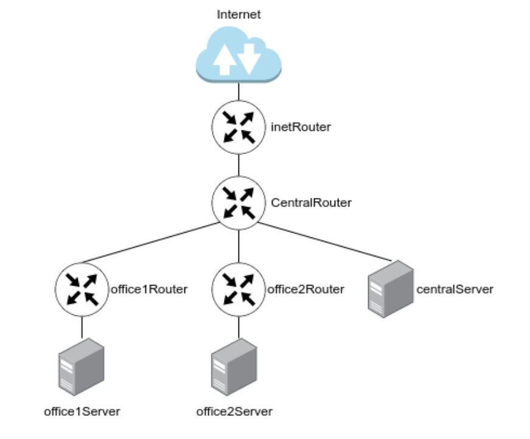

---
ОС для настройки: ubuntu 22_04 (7 виртуальных машин)

Vagrant версии 2.4.1

VirtualBox версии 7.0.18

---
- Этап 1: Теоритическая часть. Подсчет сетей

**Подсчет данных по сетям дал следующий результат**


| Name            | Network         |  Netmask        | N                                  | Hostmin      | Hostmax       | Broadcast   | 
| --------------- | --------------- | --------------- | ---------------------------------- |------------- | ------------- |------------ |
|                 |                 |                 | Central Network                    |              |               |             |
| Directors       |192.168.0.0/28   |255.255.255.240  | 14                                 |192.168.0.1   |192.168.0.14   |192.168.0.15 |
|Office hardware  |192.168.0.32/28  |255.255.255.240  | 14                                 |192.168.0.33  |192.168.0.46   |192.168.0.47 |
|Wifi(mgt network)|192.168.0.64/26  |255.255.255.192  | 62                                 |192.168.0.65  |192.168.0.126  |192.168.0.127|
|                 |                 |                 | Office 1 network                   |              |               |             |
| Dev             |192.168.2.0/26   |255.255.255.192  | 62                                 |192.168.2.1   |192.168.2.62   |192.168.2.63 |
| Test            |192.168.2.64/26  |255.255.255.192  | 62                                 |192.168.2.65  |192.168.2.126  |192.168.2.127|
| Managers        |192.168.2.128/26 |255.255.255.192  | 62                                 |192.168.2.129 |192.168.2.190  |192.168.2.191|
| Office hardware |192.168.2.192/26 |255.255.255.192  | 62                                 |192.168.2.193 |192.168.2.254  |192.168.2.255|
|                 |                 |                 | Office 2 network                   |              |               |             |
| Dev             |192.168.1.0/25   |255.255.255.128  | 126                                |192.168.1.1   |192.168.1.126  |192.168.1.127|
| Test            |192.168.1.128/26 |255.255.255.192  | 62                                 |192.168.1.129 |192.168.1.190  |192.168.1.191|
| Office          |192.168.1.192/26 |255.255.255.192  | 62                                 |192.168.1.193 |192.168.1.254  |192.168.1.255|
|                 |                 |                 | InetRouter — CentralRouter network |              |               |             |
| Inet — central  |192.168.255.0/30 |255.255.255.252  | 2                                  |192.168.255.1 |192.168.255.2  |192.168.255.3|

---
- Этап 2: Практическая часть. Настройка сети

Какими бы мои старания и танцы с бубном не были занимательными, мне не удалось на виртуальной машине специально для ДЗ развернуть 7 виртуалок из вагранта. Всё неистово падало и вылетало где-то на создании 3-4 вм. Проблема проста - нехватка ресурсов. Поэтому пришлось развернуть их на своем основном хосте. С лагами и подвисаниями, но получилось. 
Все делалось как и ранее, руками со скриншотами. Погнали

**Настройка NAT**

Работаем на inetRouter


```bash
#Проверяем что отключен другой фаервол
systemctl status ufw
``` 
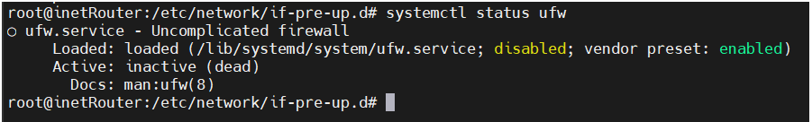

Все ок, отключен


**Создаем /etc/iptables_rules.ipv4**


**Важно**
В конце работы я столкнулся с тем, что пинги в интернет не уходят с других сервером. А внутри все остальное пингуется хорошо. Сразу закралась мысль, что где-то намудрил с NAT. Так и оказалось, поэтому команда из методички должна быть изменена в части интерфейса. Не eth0, а который у меня, enp0s3

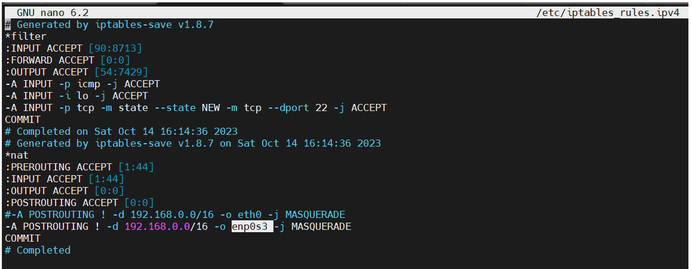

```bash
# Generated by iptables-save v1.8.7 on Sat Oct 14 16:14:36 2023
*filter
:INPUT ACCEPT [90:8713]
:FORWARD ACCEPT [0:0]
:OUTPUT ACCEPT [54:7429]
-A INPUT -p icmp -j ACCEPT
-A INPUT -i lo -j ACCEPT
-A INPUT -p tcp -m state --state NEW -m tcp --dport 22 -j ACCEPT
COMMIT
# Completed on Sat Oct 14 16:14:36 2023
# Generated by iptables-save v1.8.7 on Sat Oct 14 16:14:36 2023
*nat
:PREROUTING ACCEPT [1:44]
:INPUT ACCEPT [1:44]
:OUTPUT ACCEPT [0:0]
:POSTROUTING ACCEPT [0:0]
-A POSTROUTING ! -d 192.168.0.0/16 -o enp0s3 -j MASQUERADE
COMMIT
# Completed on Sat Oct 14 16:14:36 2023

``` 

**Создаём файл, в который добавим скрипт автоматического восстановления правил при перезапуске системы**

```bash
nano /etc/network/if-pre-up.d/iptables

#!/bin/sh
/sbin/iptables-restore < /etc/iptables_rules.ipv4

reboot
iptables-save
```

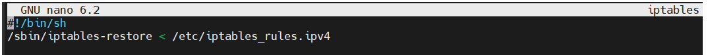


```bash
# Добавляем права на выполнение файла /etc/network/if-pre-up.d/iptables
sudo chmod +x /etc/network/if-pre-up.d/iptables

reboot
iptables-save
```

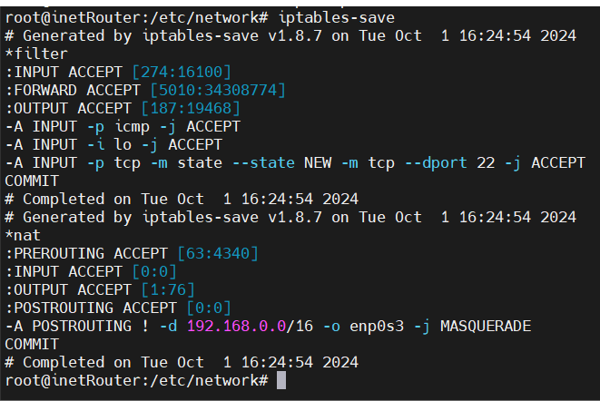


**Маршрутизация транзитных пакетов (IP forward)**
Выполняем на всех серверах

```bash
echo "net.ipv4.conf.all.forwarding = 1" >> /etc/sysctl.conf
sysctl -p

#Проверяем 
sysctl net.ipv4.ip_forward
#Должно быть 1
```

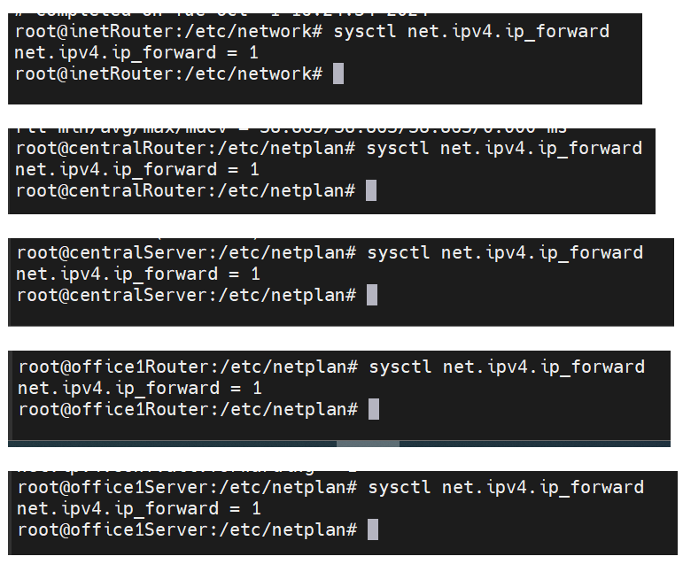
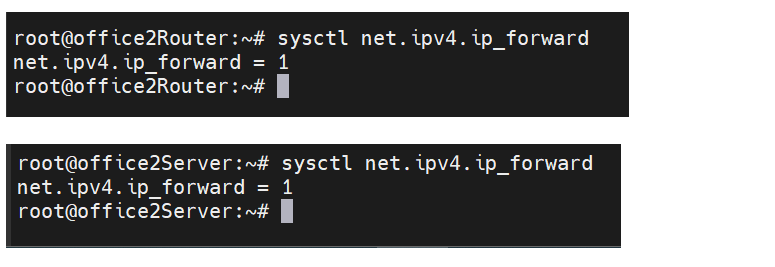


**Отключение маршрута по умолчанию на интерфейсе enp0s3**
Работаем на всех хостах кроме **inetRouter**


Для отключения маршрута по умолчанию в файле /etc/netplan/50-cloud-init.yaml добавляем отключение маршрутов, полученных через DHCP:

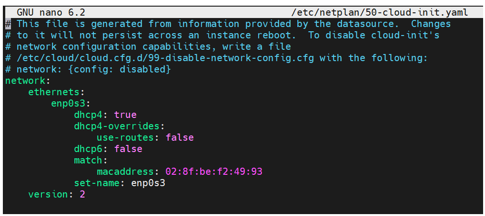


```bash
# После внесения данных изменений перезапускаем сетевую службу: 
netplan try
```

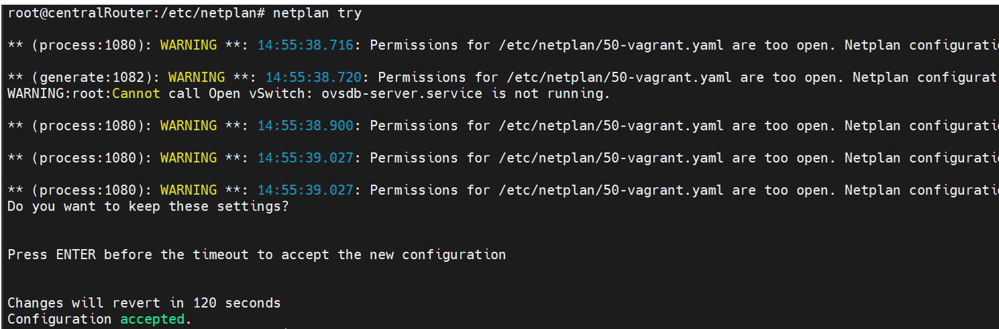


**Настройка статических маршрутов**

Самая сложная часть, где легко запутаться. Лучше рисовать схемку в тетрадке, как по мне, или скрин иметь на втором мониторе

Опираясь на предложенную схему сети, получаем следующие настройки. Показываю поэтапно на всех серверах, файл 50-vagrant.yaml
```bash
nano /etc/netplan/50-vagrant.yaml
```

inetRouter
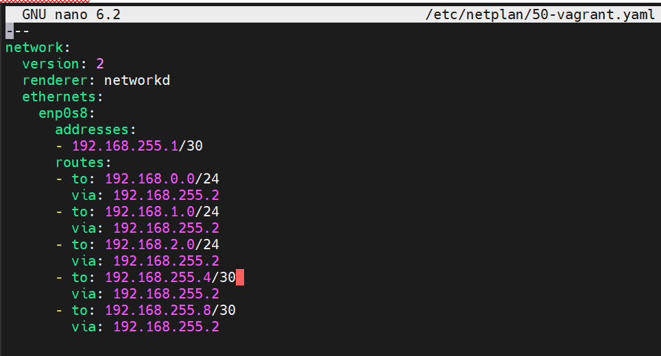


centralRouter
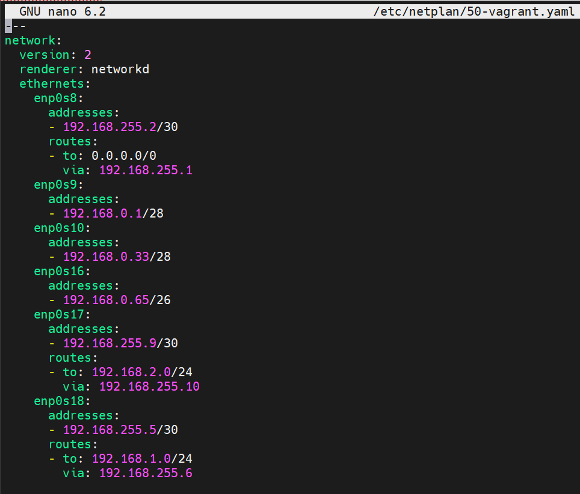


centralServer
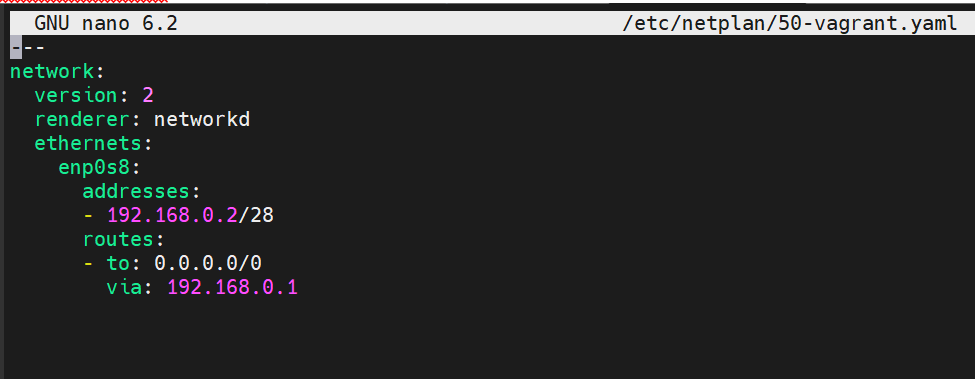


office1Server
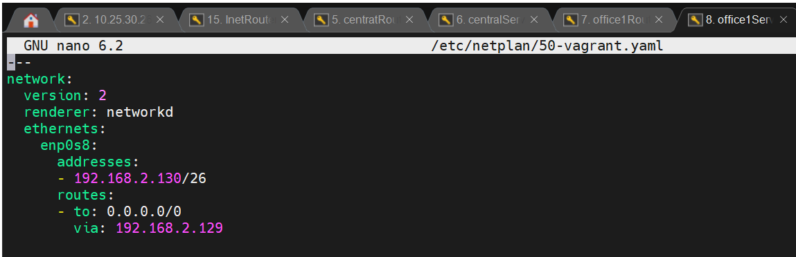


office2Server
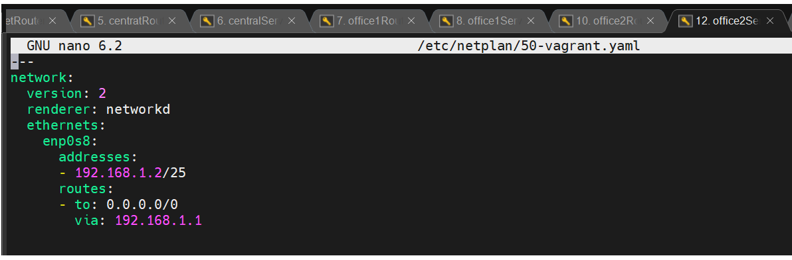


office1Router
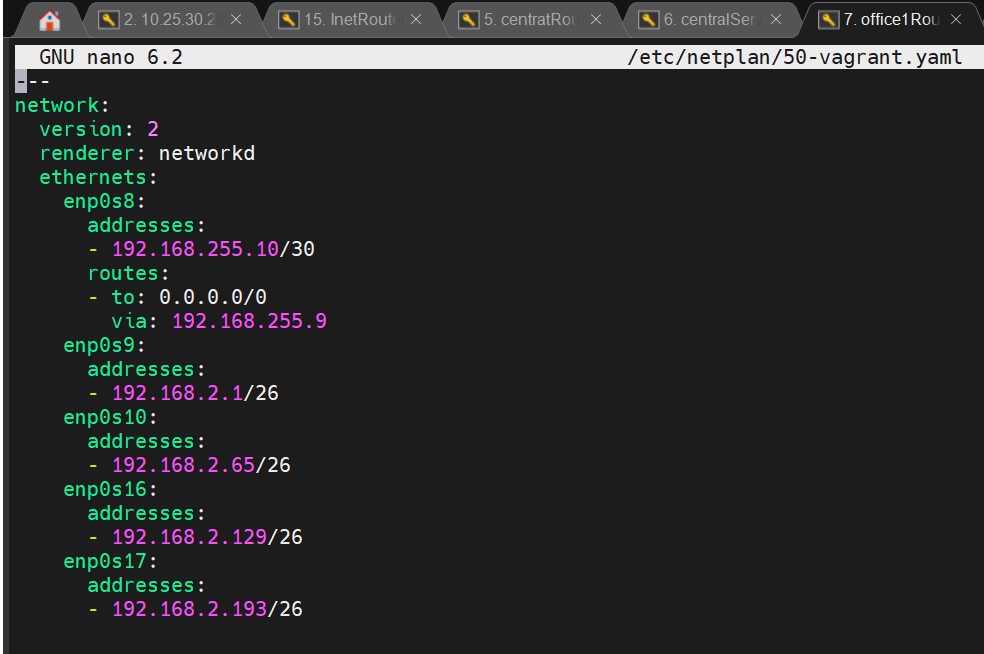


office2Router
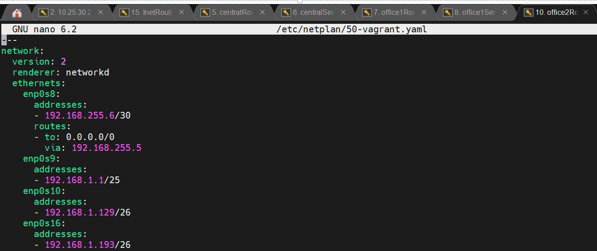


```bash
# После внесения изменений - применяем (на всех серверах)
netplan try
```


**Проверка работоспособности стенда**

Для примера, попробуем попинговать сеть с выборочных хостов 

C office2Server
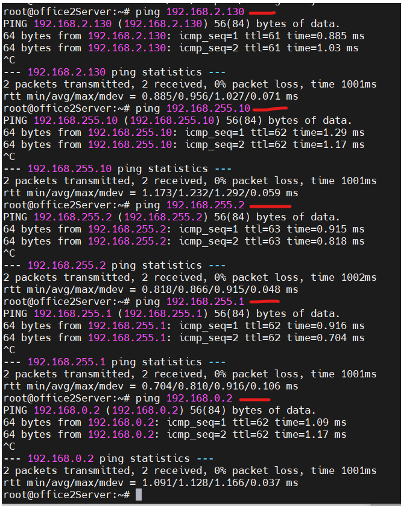


C centralServer
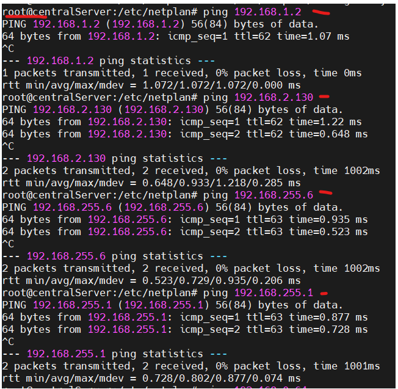


Внутри сеть пингуется. Теперь посмотрим на доступ в интерент, на примере office1Server


Обновляем пакеты
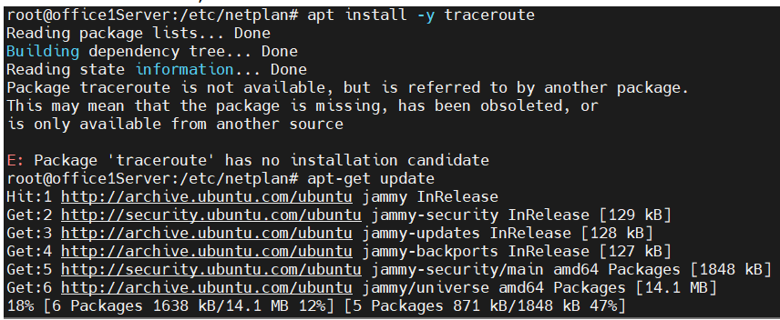

Замечу, что процесс как будто бы медленнее, чем обновление на inetRouter, но может просто кажется 

```bash
#Установка утилиты
apt install -y traceroute
```
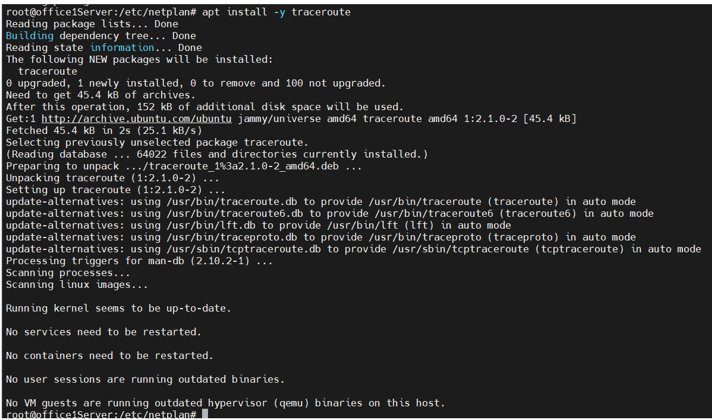


**Пингуем гугл (точнее, трассировку смотрим)**

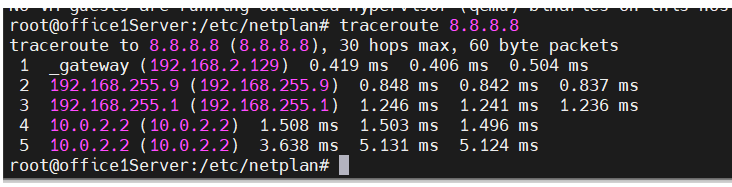


**в первых трёх переходах мы видим что запрос идет через сервера: office1Router — centralRouter — inetRouter**
